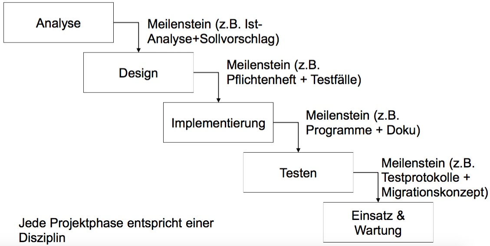
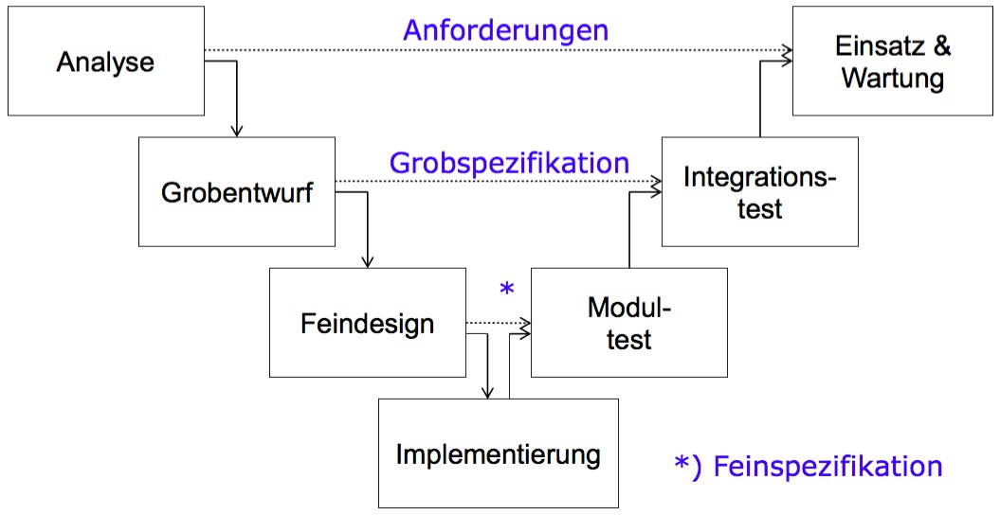
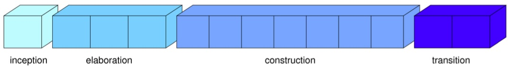

# Übungsblatt 02
## 1. SOFTWAREENTWICKLUNGSMODELLE
**Erläutern Sie Vor- und Nachteile der folgenden Vorgehensmodelle zur Softwareentwicklung:**
* **Wasserfall-Modell**
  * WFM geht von sequentiellem Ablauf aus
    * Annahme: keine Korrekturen notwendig!
  * WFM läßt Vorgehen bei Problemen undefiniert
    * Design zeigt Unvollständigkeit der Analyse
    * Implementierung zeigt Auslassungen des Design auf
    * Testen deckt Fehler der Implementierung auf
  * Unterschätzt die Bedeutung von Veränderung
  * Iteriertes Wasserfallmodell als Konsequenz
    * Integriert Rückkopplungsschleifen

 

* **V-Modell**
  * Gefahr von Mißverständnissen
    * (ausführbarer) Code erst am Ende des Projekts
    * Gefahr kann tw. durch Prototypen begegnet werden
  * Gefahr sich ändernder Anforderungen
  * Je grundlegender ein Fehler, umso später wird er gefunden
    * Analysefehler in Einsatz & Wartung
    * Fehler im Entwurf im Integrationstest
    * Fehler im Feinentwurf im Modultest
  * Aber: V-Modell auch kompatibel mit anderen Prozessen: V-Modell XT (neue Versionen)

 

* **Spiralmodell**
  * Versucht mit größten Risiko umzugehen
  * Iterativ verfeinerung
  * Verbesserung des Wasserfallmodells
    * Gleiche Aufgabe wie Wasserfallmodell
    * Jede Aufgabe durch Prototypen abgeschlossen
    * Fortschritt besser kommuniziert
    * Risikoanalyse frühe Erkennung von Risiko

* **Unified Process**
  * kurze Iterationsdauer
  * jede Iteration endet mit einem volständigen System
  * Inkrementell
  * UP akzeptiert, dass nicht das gesamte Vorgehen initial geplant werden kann

 

 

---
## 2. PROTOTYPING
**Erklären Sie die Begriffe “Vertikaler Prototyp” und “Horizontaler Prototyp”. Erläutern Sie, wann welche Art eingesetzt wird und warum. Welche Implementierung würden Sie für die Erstellung eines Online-Shops wählen? Begründen Sie Ihre Wahl.**

* Vertikaler Prototyp:
  * Umsetzung einer Kernfunktionalität
  * Auswahl kritischer Funktionalität
    * Machbarkeitstest
    * Effizienztest
    * Vergleich von Alternativen
    * Aufwandsabschätzung
  * Wenig Wert auf Ergonomie
  * Kann als “Pilotsystem” den Kern der zukünftigen Anwendung darstellen
  * Forschungsprototypen typischerweise vertikal
  * Reduzieren von Machbarkeitsrisiken
* Horizontaler Prototyp
  * Implementierung aller Funktionen einer Ebene
  * Auswahl der Ebene mit dem größten Risiko
    * Risiko für Mißverständnisse
    * Risiko für wechselnde Anforderungen
  * Erster Eindruck für den Kunden
  * In der Regel wird der Prototyp verworfen
    * Schnell “heruntergehackter” Code
    * Qualität kein Kriterium
    * Keine Dokumentation
  * Demonstrator z.B. GUI mit Beispieldaten
  * Reduziert das Risiko von Mißverständnissen

---
## 3. SOFTWAREENTWICKLUNGSMODELLE
**Sie sind Projekt-Manager für ein Software Projekt. Für die folgenden Aufgaben, welche der klassischen Entwicklungsmethoden würden Sie verwenden? Begründen Sie jeweils Ihre Entscheidung!**
 **a) Realisierung eines Tot-Mann-Schalters für den Zugfahrer. (Ein Tot-Mann-Schalter ist eine Sicherungsanlage, die jede Minute betätigt werden muss. Anderenfalls wird eine Notbremsung ausgeführt.)**
 * V-Modell nach EN 50128 empfohlen

 **b) Sie arbeiten in einem kleinen Team mit Ihnen und zwei Mitarbeitern an einem neuen Sortierverfahren, dass in O(n) eine Liste sortieren kann.**
 * kein Projektmodell nötig

 **c) Ihr Kunde möchte von ihnen eine Website für sein Unternehmen entwickelt haben.**
 * Spiralmodell

---
## 4. BEDEUTUNG REQUIREMENTS ENGINEERING
**Welche Rolle spielt die Anforderungsanalyse in der Softwaretechnik? Welche potentiellen Gefahren gibt es, wenn man ohne Anforderungsanalyse einfach schon mal entwickelt? Nehmen Sie zur Beantwortung der Frage zu jedem Bild Stellung und beschreiben Sie Probleme und mögliche Lösungen.**

* Anforderung: - Bedingung oder Eigenschaft, die ein System benötigt
  * um ein Problem zu lösen
  * um ein Ziel zu erreichen
  * um einem Vertrag, Standard oder ähnlichem zu genügen
* Gefahren:
  * Projekt scheitert
  * Projektkosten übersteigen das Budget
  * Unnutze Arbeit / Entwicklung von vorne beginnen
  * kein zielorientiertes Lösen des Problems
  * Dokumentation nicht vollständig/ fehlt
  * nicht funktionierende/r Code/Software

* How the customer explained it:
  * Problem:
    * zu viel Details/Informationen
    * zu komplex Problembeschreibung
    * dem Kunden ist nicht ganz bewusst was genau er braucht/will
    * Kunde hat technischen oder veraltet Hintergrund
  * Lösung:
    * fortlaufende Meetings über Phase der Anforderungsanalyse
    * Ausarbeitung der Anforderungen oder Lösungsansatz mit dem Projektleiter zusammen

* How the project leader understood it:
  * Problem:
    * falsches Verständnis des Problems/der Anforderungen
  * Lösung:  
    * Zusammen Problemlösung erarbeiten
	* Pflichtenheft anfertigen und zurück an den Kunden
	* Meetings für Rücksprache

* How the engineer designed it:
  * Problem:
    * benutzerunfreundliches Design
    * Design entspricht nicht dem Kundenvorstellungen
    * Umsetzung der Lösung anhand der Informationen des Projektleiters
  * Lösung:  
    * Einfaches Design
    * Designvorstellungen
	* Rücksprache

* How the programmer wrote it:
  * Problem:
    * Code funktioniert nicht, macht nicht das was er machen soll
	* Problem nicht verstanden
  * Lösung:  
    * Rücksprache mit Projektleiter und Kunde
	* Vorstellung von Teilfunktionen

* How the sales executive described it:
  * Problem:
    * Übertreibung der Funktion/Produkte beim Verkauf
  * Lösung:  
    * Realitätsnahe Beschreibung der Produkte

* How the project was documented:
  * Problem:
    * Keine Dokumentation
  * Lösung:  
    * Dokumentation zur Arbeit
    * Vereinbarungen anfertigen

* What operations installed
  * Problem:
    * Fehlende Funktionen
  * Lösung:  
    * Testen ob alle geforderten Funktionen vorhanden sind

* How the customer was billed:
  * Problem:
    * Produkt/Software zu teuer im Vergleich der gegebenen Funktion
  * Lösung:  
    * Transparente Kostenentwicklung (Dokumentation)

* How the helpdesk supported it:
  * Problem:
    * Produkt Auslieferung ohne/mit schlechten Support/Wartung
  * Lösung:  
    * Support in der Entwicklung mit aufbauen

* What the customer really needed:
  * Problem:
    * Abweichung der benötigten Funktionen der Produkte von der was ausgeliefert wurde
  * Lösung:  
     * Wenn alle vorherigen Probleme gelöst und berücksichtigt werden, bekommt der Kunde das was er braucht

---
