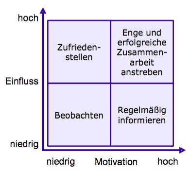

# Übungsblatt 03
## 1. REQUIREMENTS ENGINEERING
**Was ist Requirements Engineering? Erläutern Sie die 3 Ziele des Requirement Engineerings.**

* 3 Ziele:
  * Relevante Anforderungen bekannt und verstanden sind
  * Stakeholder ausreichende Übereinkunft über bekannte Anforderungen erreichen
  * Anforderungen entsprechend der Dokumentations- und Spezifikationsvorschriften erfasst sind

**Was sind Anforderungen?**
* Notwendige Bedingung oder Eigenschaft
  * eines Systems oder einer Person, um ein Ziel zu erreichen oder Problem zu lösen
  * eines Systems oder einer Komponente, um einen Standard, Vertrag oder Ähnliches zu erfüllen
* Nach IEEE des weiteren dokumentierte Anforderungen
* Hier: Anforderungsartefakt nach [Pohl 2008]
* bilden die Grundlage für den Vertrag zwischen Kunden und Entwickler

**Welche Rolle spielt die Nachverfolgbarkeit?**
* bildet den Nachweis über die Erfüllung aller Anforderungen
* Vertrag ist erst erfüllt, wenn alle Requirements umgesetzt sind

**Wie kann sie erreicht werden?**
* durch eine Liste von Requirements
  * wird aus dem Anforderungsdokument des Kunden erstellt
  * jeder Satz bekommt eine ID
  * Sätze mit mehreren Requirements werden aufgelöst in mehrere Unterrequirements
* Einfache Tabellenstruktur
  * Excel
  * Manuelles Tracing, keine Links
* Einbettung in IDE
  * PlugIn für Eclipse: ProR
  * Einfache Objekt-orientierte Struktur • Manuelles Tracing
  * Links
* Proprietäre Software
  * IBM Rational Doors
  * Multi-User (simultanes Arbeiten)
  * Schnittstellen zu UML-Tools und IDEs (halb- automatisches Tracing)
  * Links

---
## 2. ANFORDERUNGEN
**Anforderungen lassen sich in verschiedene Klassen aufteilen. Beschreiben Sie die Klassen und geben Sie für jede Klasse zwei Beispiele aus dem Fußball Tippspiel an. Laden Sie sich dazu die Beschreibung aus dem Downloadbereich herunter.**
* Funktionale Anforderungen
  * Beschreibung einer Funktionalität, die vom System zu erfüllen ist mit
    * Aktionen und Interaktionen des Systems
    * Eingaben
    * Ausgaben
    * Einschränkungen
  * Beispiele:
    * Kunden können das Ergebnis des nächsten Spiels ab 24 Stunden vor Spielbeginn bis zum Spiel vorhersagen
    * Während unsere Kunden das Spiel live auf unserer Webseite ansehen können, wird Ihnen ständig angezeigt, wie wahrscheinlich ihr Tipp sein wird
* Qualitätsanforderungen
  * Beschreibung von gewünschten Qualitätsmerkmalen an das System, eine Komponente oder eine Funktion
  * Beispiele:
    * Übersicht, wie viele unserer Kunden das Tipp-Spiel benutzen und ob es mehr Kunden auf unsere Seite lockt als vorher
    * Übersicht, wie viele Personen aufgrund des Rabattes etwas bestellt haben
* Randbedingungen
  * Einschränkungen, von denen das System oder dessen Entwicklung betroffen ist
    * Versicherungsbedingungen
    * Gesetzliche Vorgaben
    * Normen und Standards, die erfüllt werden müssen (ISO, DIN, ...)
    * Einflüsse der Einsatzumgebung
    * Aufwandsbeschränkungen (Kosten, Personal, ...)
    * Zertifizierungen
    * ...
  * Beispiele:
    * die Mehr-Nutzer sollten in einem guten Verhältnis zu den Serverkosten stehen, die wir für das Tipp-Spiel benötigen
* Nicht-funktionale Anforderungen
  * Großer Spielraum für Interpretationen
  * Hinterfragen und spezifizieren ist notwendig
  * Bestimmen von funktionalen und Qualitätsanforderungen, um objektivere und überprüfbare Anforderungen zu schaffen

---
## 3. STAKEHOLDER
**Was ist ein Stakeholder?**
* Stakeholder sind Organisationen und Personen, die von dem zu entwickelnden Produkt betroffen sind
* Zuordnung zu Rollen (Auftraggeber, Endnutzer, Administrator, ...)
* Haben verschiedene Anforderungen, die berücksichtigt werden müssen/können
* Wichtigste Quelle für Anforderungen

**Identifizieren Sie 2 Beispiele für das Fußball-Tippspiel. Laden Sie sich dazu die Beschreibung aus dem Downloadbereich herunter. Wie kann ein Stakeholder in die Anforderungsgewinnung einbezogen werden?**
* Stakeholder:
  * Betreiber für Toma-Gotchi-Pflanzen
  * Nutzer

**Auf welche Probleme können Sie dabei stoßen?**
* Unterschiedliche Verwendung von Begriffen
* Stakeholder sind nicht ehrlich
* Stakeholder können ihre Wünsche nicht ausdrücken oder haben keine
* Widerstand der Stakeholder
* Ziel-/Anforderungskonflikte
* Fokussierung auf eine bestimmte Lösung
* Anforderungen ändern sich
* Zeitmangel
* Verfügbarkeit
* Falsche Erwartungen
* Eisberg-Metapher
  * Viele Zusatzinformationen sind verdeckt:
    * Selbstverständliches
    * Gewohnheiten
    * Erfahrungen
    * Vergessenes
    * ...

**Erläutern Sie die Einteilung von Stakeholdern nach Rupp.**

* Einfluss hoch, Motivation hoch
  * Sollten möglichst stark eingebunden werden
  * Haben Willen und Macht Entscheidungen durchzusetzen
* Einfluss hoch, Motivation niedrig
  * Pflege und Zufriedenstellung nötig
  * Vermeidung von zu viel Details und Informationen
* Einfluss niedrig, Motivation hoch
  * Ständige Information und Kommunikation
  * Weisen auf möglicherweise entstehende Probleme hin
  * Verfügen oft über Informationen zu Details
  * Können Begeistern und Motivieren
* Einfluss niedrig, Motivation niedrig
  * Nichtvergessen,aber Aufwand gering halten
  * Relevante Informationen über Zugriff zur Verfügung stellen (z.B. Intranet)
