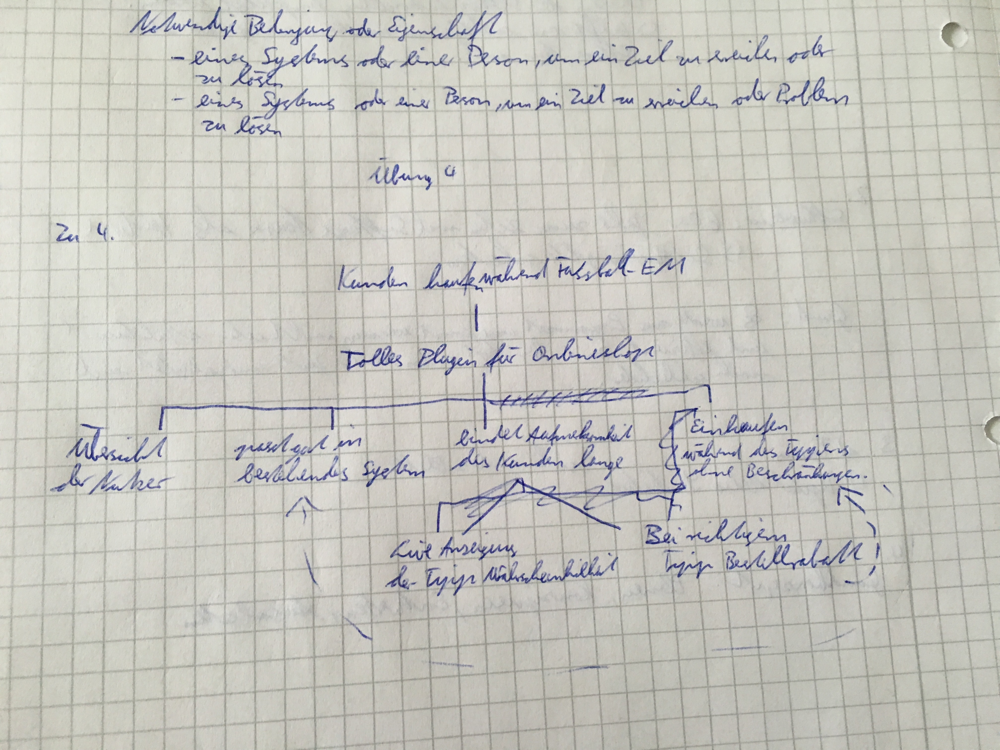
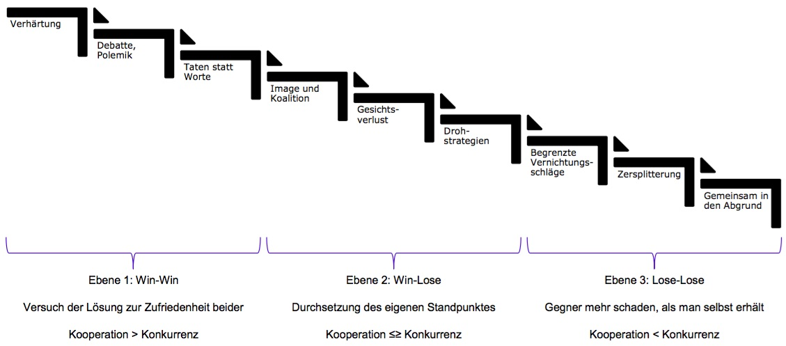
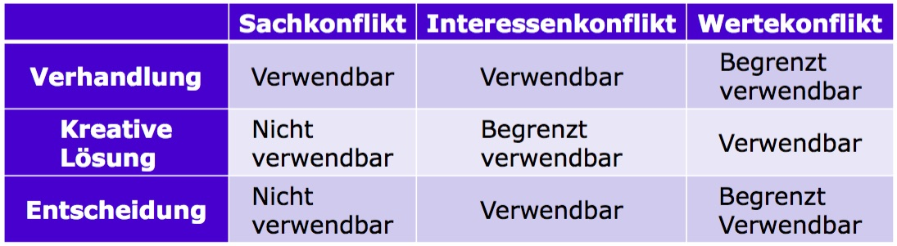

# Übungsblatt 04
## 1. VOLERE TEMPLATE
**Templates helfen, wichtige Aspekte zu identifizieren und sicherzustellen, dass keine Aspekte vergessen wurden. Zur Identifikation von Requirements kann hierzu eine Formalisierung des Projektes hilfreich sein. Laden Sie sich deshalb aus dem Downloadbereich das Volere Requirements Specification Template herunter. Füllen Sie die Bereiche 1-6 („Purpose of the project“ bis „Relevant Facts“) für das Fußballtippspiel aus.**

### 1. The Purpose of the Project
#### 1a. The User Business or Background of the Project Effort
* Content
* Motivation
* Considerations

#### 1b. Goals of the Project
* Content
* Motivation
* Examples
* Measurement

### 2. The Client, the Customer, and Other Stakeholders
#### 2a. The Client
* Content
* Motivation
* Considerations

#### 2b. The Customer
* Content
* Motivation

#### 2c. Other Stakeholders
* Content
* Motivation

### 3. Users of the Product
#### 3a. The Hands-On Users of the Product
* Content
* Motivation
* Examples

#### 3b. Priorities Assigned to Users
* Content
* Motivation

#### 3c. User Participation
* Content
* Motivation

#### 3d. Maintenance Users and Service Technicians
* Content
* Motivation

### 4. Mandated Constraints
#### 4a. Solution Constraints
* Content
* Motivation
* Examples
* Considerations

#### 4b. Implementation Environment of the Current System
* Content
* Motivation
* Examples
* Considerations

#### 4c. Partner or Collaborative Applications
* Content
* Motivation
* Examples
* Considerations

#### 4d. Off-the-Shelf Software
* Content
* Motivation
* Examples
* Considerations

#### 4e. Anticipated Workplace Environment
* Content
* Motivation
* Examples
* Considerations

#### 4f. Schedule Constraints
* Content
* Motivation
* Examples
* Considerations

#### 4g. Budget Constraints
* Content
* Motivation
* Considerations

### 5. Naming Conventions and Definitions
#### 5a. Definitions of All Terms, Including Acronyms, Used in the Project
* Content
* Motivation
* Examples
* Considerations

#### 5b. Data Dictionary for Any Included Models
* Content
* Motivation
* Examples
* Considerations

### 6. Relevant Facts and Assumptions
#### 6a. Facts
* Content
* Motivation
* Examples

#### 6b. Assumptions
* Content
* Motivation
* Examples
* Considerations

---
## 2. BESCHREIBUNG VON ANFORDERUNGEN
**Identifizieren Sie jeweils mindestens 5 funktionale und nicht-funktionale Anforderungen (welche noch nicht in Aufgabe 1 ermittelt wurden) für das Fußballtippspiel.**
* funktional:
  * Livestream
  * Tippfunktion
  * Tippwahrscheinlichkeit anzeigen
* nicht-funktional
  * Bestellrabatt bestimmen
  * Verlosung für die Gewinner des Tippspiels

**Erklären Sie anhand Ihrer Beispiele den Unterschied zwischen funktionalen und nicht-funktionalen Anforderungen. Beschreiben Sie diese mit der Volere Snow Card. Sind Ihre Anforderungen gute Anforderungen?**

| Volere Snow Card      |  |  |
| --------------------- | ---------------- | ---- |
| Requirement           | Requirement Type | Event/use case |
| Description           |
| Rationale             |
| Originator            |
| Fit Criterion         |
| Customer Satisfaction | Costemer Dissatisfaction |
| Priority              | Conflicts |
| Supporting Materials  |
| History               |

---
## 3. ANFORDERUNGSDOKUMENTE NACH DIN 69905
**Lasten- und Pflichtenhefte stellen wichtigste Dokumente nach DIN 69905 dar. Was macht das jeweilige Dokument aus?**

* Lastenheft:
  * Alle Forderungen an Lieferung und Leistung des Auftragnehmers
  * Meist vom Auftraggeber erstellt
  * Weitere Forderungen:
    * die der Anwender an das System hat
    * Randbedingungen an System und Entwicklung

* Pflichtenheft:
  * Beschreibt Realisierungsvorgaben des Auftragnehmers und Realisierung des Lastenhefts
  * Lastenheft ist oft selbst Bestandteil

**Worin bestehen die Unterschiede?**

* Pflichtenheft ist detaillierter als das Lastenheft und dient als Ergänzung zum Lastenheft

---
## 4. ZIELE
**Identifizieren Sie mindestens 8 Ziele und Unterziele im Fußballtippspiel.**

* Entwicklung eines Plugin eines bestehenden Spiels
* Kunden kaufen auch während der Fußball-EM dort ein
* Tolles Plugin für online Shop
* passt gut in das bestehende System
* Kunden und deren Aufmerksamkeit möglichst lange binden
* Kunden können ohne Einschränkungen nebenbei im Shop einkaufen
* Live Anzeigung der Tipp Wahrscheinlichkeit
* Übersicht über dauerhafte Nutzer
* Bei richtigem Tipp Bestellrabatt

**Gestalten Sie aus denen von Ihnen ermittelten Zielen einen Und-Oder-Graph. Berücksichtigen Sie auch Konflikte und Abhängigkeiten.**

---
## 5. KONFLIKTAUFLÖSUNG
**Beschreiben Sie das Konflikteskalationsmodell nach GLASL. Diskutieren Sie Möglichkeiten der Konfliktauflösung für die erste Ebene des Konflikteskalationsmodells.**

* 1.Ebene: Win-Win   
  * Versuch der Lösung zur Zufriedenheit beider  Kooperation > Konkurrenz
* 2.Ebene: Win-Lose  
  * Durchsetzung des eigenen Standpunktes        Kooperation ≤≥ Konkurrenz
* 3.Ebene: Lose-Lose
  * Gegner mehr schaden, als man selbst erhält   Kooperation < Konkurrenz

* Stufen in Ebene 1:
  * Verhärtung
  * Debatte,Polemik
  * Taten statt Worte

* Möglichkeiten der Konfliktauflösung:
  * Verhandlung:
  * Auflösung durch Austausch von Argumenten, Meinungen und Informationen

  * Entscheidung:
    * Entscheidungsträger (übergeordnete Instanz, Auftraggeber)
fällt Entscheidung zugunsten eines der beiden Standpunkte

  * Kreative Lösung:
Verwerfen der bisherigen Standpunkte und entwickeln eines unabhängigen neuen

**Ab welcher Stufe wäre Ihrer Meinung nach professionelle Hilfe spätestens notwendig?**

* Ab dem Gesichtsverlust und spätestens bei der Drohstrategie sollte man sich professionelle Hilfe holen.
* Später ist es kaum noch aufhaltbar.
