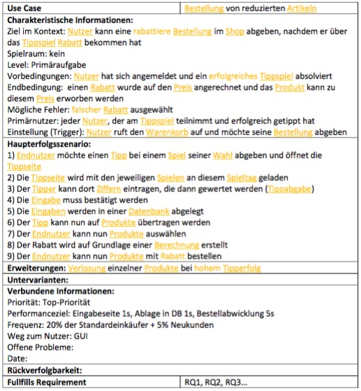
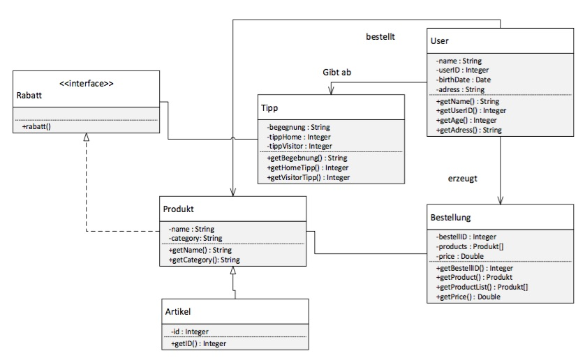

# Übungsblatt 06
## 1. KONZEPTE IDENTIFIZIEREN
**Identifizieren Sie systematisch am Beispiel des Use Cases „Bestellung von reduzierten Artikeln“, die in ihm vorkommenden Konzepte. Sollten Sie diesen Use-Case noch nicht erstellt haben, so muss dieser zuvor entsprechend dem Cockburn-Template erstellt werden.**

* **Wenden Sie die Nominalphrasen-Methode auf den Use Case an.**

  

* **Sortieren Sie anschließend ihre Konzepte in eine Konzeptkategorienliste.**

| Kategorie | Konzept |
| :-------: | ------- |
| Physische Objekte | Produkt, Artikel |
| Transaktionen | Rabatt, Bestellung |
| Externe (Computer-)Systeme |   |
| Organisationen | Shop, Tippseite, Datenbank |
| Interne Datensätze | Tipp, Rabatt |
| Externe Datensätze |    |
| Nutzer | Nutzer |   
| Rollen | Nutzer |
| Ereignisse | Tipperfolg |

* **Identifizieren Sie anhand der vorgestellten Verfahren die irrelevanten Konzepte.**

  * Ziffern, Spiel

* **Erstellen Sie ein Glossar der Konzepte mit Synonymen und Konzeptbeschreibungen.**

| Glossar | Beschreibung | Synonym |
| :-----: | ------------ | ------- |
| Produkt | Zum Kauf angebotene Gegenstände | Artikel |
| Rabatt | Ermäßigung des Preises, hervorgerufen durch erfolgreichen Tipp |   |
| Bestellung | Vorgang, wie der Kunde seine Produkte erwirbt |   |
| Shop | Virtueller Ort, wo der Kunde einkauft, das Tippspiel abgibt und die Bestellung abgibt |   |
| Datenbank | Datenspeicherort für alle relevanten Daten |   |
| Nutzer | Nutzer des Shops | Endnutzer, User, Kunde |
| Tipp | Ergebnisvorhersage eines Fußballspiels durch den Nutzer |   |
| Berechnung | Ermittlung des Rabattes |   |
| Tipperfolg | Erfolgreiche Vorhersage eines Spiels |   |

---
## 2. KLASSENDIAGRAMM
**Modellieren Sie nun die Konzepte aus Aufgabe 1 als Konzeptklassen in einem Klassendiagramm bzw. Konzeptmodell.**
*Hinweis: Das Klassendiagramm ist mit ein Modellierungstool zu erstellen.*

---
## 3. ASSOZIATIONEN
**Erläutern Sie anhand ihres Konzeptmodells in Aufgabe 2, an welchen Stellen Assoziationen der Verwendung von Attributen vorzuziehen wären bzw. warum Sie Assoziationen statt Attributen gewählt haben.**
