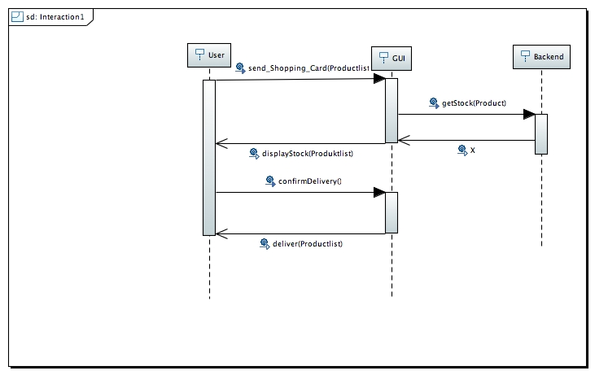
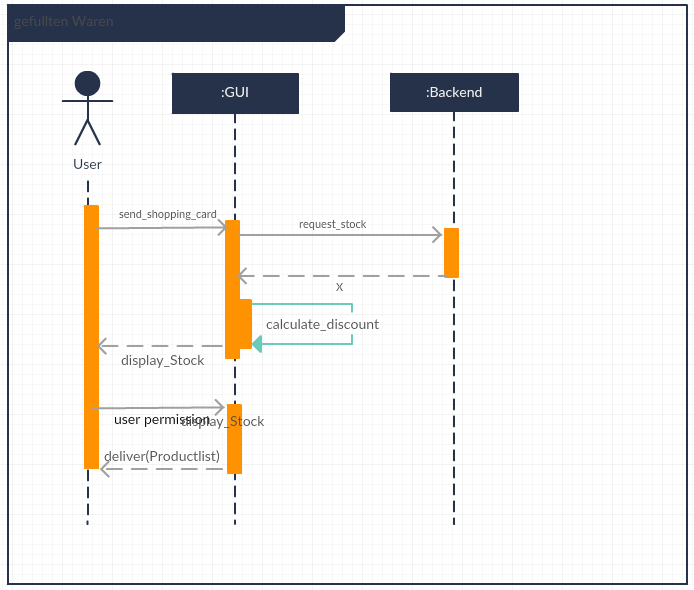
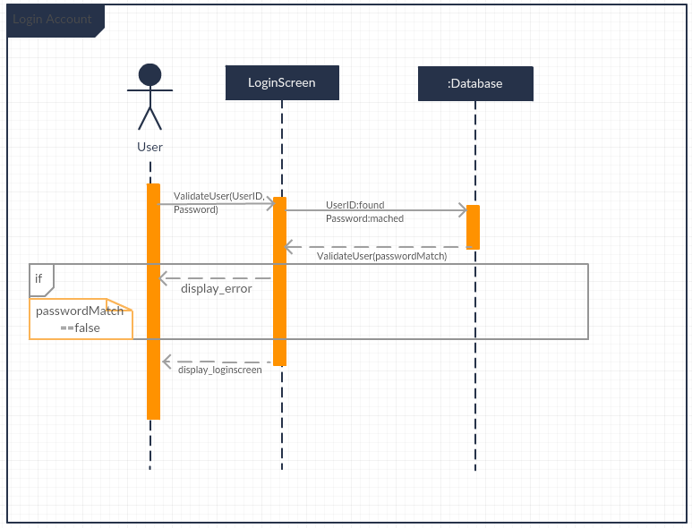

# Übungsblatt 07
## 1. SEQUENZDIAGRAMME
**Mit Hilfe von Sequenzdiagrammen können Programmabläufe (meistens Use-Cases) detailliert beschrieben werden. Dabei zeigt sich, ob das entworfene System bereits ausreichend ist oder ob Funktionen vergessen wurden. Überführen Sie den Use Case „gefüllten Warenkorb mit aktuellem Rabatt bestellen“ und einen weiteren Use Case ihrer Wahl in das jeweils zugehörige UML-Sequenzdiagramm. Ignorieren Sie in dieser Aufgabe „Combined Fragments“ (z. Bsp. alt, opt, loop, ref,...).**
*Hinweis: Im Sequenzdiagramm können lediglich Elemente (insbesondere Klassen und Funktionen) benutzt werden, welche bereits im Klassendiagramm erstellt wurden. Hier zeigt sich, wie gut bzw. ausführlich in Aufgabe 1 des letzten Übungsblattes gearbeitet wurde. Sollten für Ihre Use-Cases zusätzliche Klassen oder Funktionen notwendig sein, müssen diese nachträglich definiert worden sein. Um Akteure in Sequenzdiagrammen zu verwenden, empfiehlt es sich, ein Use-Case Diagramm zu erstellen, in denen diese Akteure definiert werden. Bei dieser Gelegenheit können und sollten die zu überführenden Use-Cases gleich in das Diagramm übernommen und mit dem Sequenzdiagramm verknüpft werden. Um eine Klasse innerhalb eines Sequenzdiagramms (als Lifeline) zu benutzen, muss eine Instanz der Klasse erstellt werden. Hierzu ist ein „Composite Diagram“ anzulegen, in der die Zusammenarbeit der Klasseninstanzen verdeutlicht werden kann.*

---
## 2. ALTERNATIVEN
**Betrachten Sie einen weiteren (keinen aus Aufgabe 1) Use Case ihrer Wahl, wobei der Use Case mindestens eine Alternative haben soll. Wie kann man die Alternative im Sequenzdiagramm darstellen? Erstellen Sie das Sequenzdiagramm inklusive der Alternative(n) in einem CASE-Tool.**

---
## 3. KONTRAKTE
**Beschreiben Sie mindestens 3 Kontrakte für beliebige Operationen aus Aufgabe 1 und 2. Nutzen Sie dabei das in der Vorlesung vorgestellte Schema um die zentralen Aspekte eines Kontrakts natürlichsprachlich zu beschreiben.**

---
## 4. OBJECT CONSTRAINT LANGUAGE
**Formulieren Sie die Kontrakte aus Aufgabe 3 in der Object Constraint Language. Erstellen Sie mindestens eine Invariante, eine Vor- und eine Nachbedingung.**
