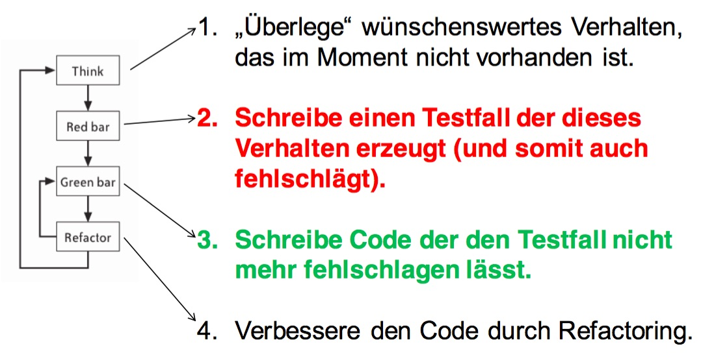
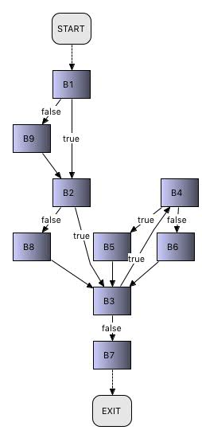
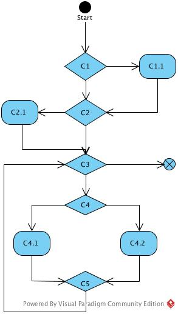

# Übungsblatt 10
## 1. TEST-DRIVEN DEVELOPMENT
**Beschreiben Sie das Vorgehen beim Test-Driven Development.**

* 1. „Überlege“ wünschenswertes Verhalten, das im Moment nicht vorhanden ist.
* 2. Schreibe einen Testfall der dieses Verhalten erzeugt (und somit auch fehlschlägt).
* 3. Schreibe Code der den Testfall nicht mehr fehlschlagen lässt.
* 4. Verbessere den Code durch Refactoring.




**Was Sind die Vor- bzw. Nachteile dieses Entwicklungsprozesses?**
 * Vorteile:
   * Bessere Fehlererkennung

* Nachteile:
  * Mehr Aufwand


**Wiestehen Siedazu? Begründen Sie Ihre Meinung.**
* Gutes Verfahren, kann jedoch je nach Größe zu Aufwendig werden.

**Wie stehen Sie dazu? Begründen Sie Ihre Meinung.**


---
## 2. BLACK-BOXES UND WHITE-BOXES
**Beschreiben Sie die Begriffe Black-Boxes und White-Boxes im Zusammenhang von Testdurchführungen mit Hilfe eines selbstgewählten Beispiels. Erklären Sie am Beispiel, wann welche Art des Testens besser geeignet ist.**

* Black-Boxes:
  * Keine innere Struktur bekannt
  * Testfälle können nur den Analysedokumenten entspringen
  * Testfälle können nur über Ein- und Ausgaben sprechen
  * Testfälle entspringen den Anforderung (zu jeder Anforderung Testfälle)
  * Use-Cases bieten sich an, da ein Use-CaseSzenario in trivialer Weise einen (Funktions-) Test impliziert
  * Grundidee: Bildung von Äquivalenzklassen

* White-Boxes:
  * Tests mit Kenntnissen über die innere Funktionsweise des zu testenden Systems
  * es wird am Code geprüft
  * häufig hierfür benutzt Kontrollflussgraph
  * Viel leichter durchführbar als Black-Box Tests

* White-Box Tests gut um Fehler in den Teilkomponenten aufzudecken und zu lokalisieren (Strukturorientiert)
* Black-Box Tests gut um Fehler gegenüber der Spezifikation aufzudecken (Funktionsorientiert)


---
## 3. TESTABDECKUNG
**Gegeben ist die folgende Funktion. Erstellen Sie den Kontrollflussgraphen für diese Funktion.**




**Bestimmen Sie mithilfe des Kontrollflussgraphen die:**
 * **a) Zyklomatische Komplexität**
   * #Kanten: 14
   * #Nodes: 11
   * #Funktionen: 0
   * C = #Kanten - #Nodes + 2 * #Funktionen = 3
 * **b) Testfälle für die Statement Coverage**
   * Jedes Statement/Knoten wurde einmal besucht.
   * $C_{0.1}=ggt(-2,-1)$
 * **c) Testfälle für die Decision Coverage**
   * Jeder Zweig/Kante wurde einmal besucht.
   * $C_{1.1}=ggt(-2,-1)$
   * $C_{1.2}=ggt(1,1)$

```
private int ggt(int zahl1, int zahl2) {
  if (zahl1 < 0) zahl1 = zahl1 * -1;
  if (zahl2 < 0) zahl2 = zahl2 * -1;
  while (zahl2 != 0) {
      if (zahl1 > zahl2) {
          zahl1 = zahl1 - zahl2;
      } else {
          zahl2 = zahl2 - zahl1;
      }
  }
return zahl1;
}
```

---
## 4. UNIT-TESTS
**Laden Sie sich die Klasse „MinMaxCalculator“ aus dem Downloadbereich herunter. Überprüfen Sie deren korrekte Funktionalität. Schreiben Sie dazu JUnit Tests. Versuchen Sie dabei, eine möglichst hohe Testabdeckung zu erreichen. Korrigieren Sie etwaige Fehler.**

*Hinweis:
JUnit ist bereits Teil der Eclipse Tools und kannüber New -> Other -> Java -> JUnit -> TestCase angelegtwerden. Es empfiehlt sich, Tests gesondert von der funktionalen Klasse zu lagern.*
