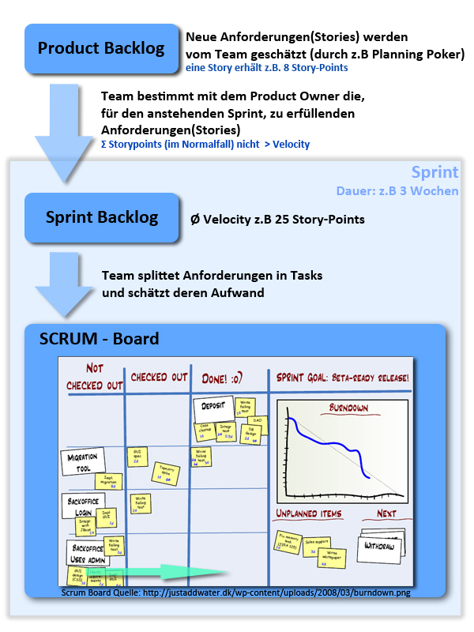
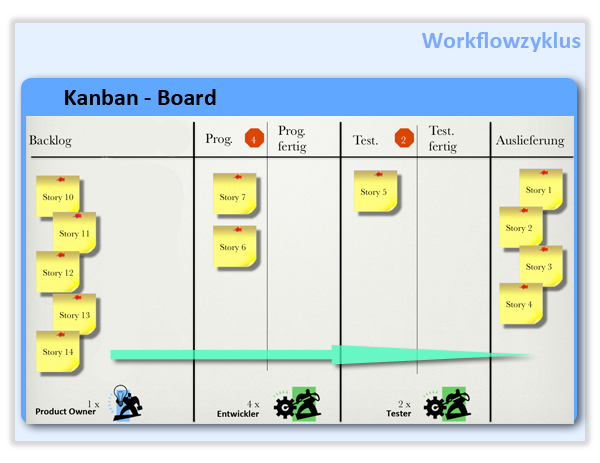

# Übungsblatt 12
## 1. AGILE METHODEN
**Was versteht man unter agilen Methoden? Wodurch zeichnen sich diese aus? Gehen Sie dabei auch auf die Unterschiede zwischen klassischen Prozessen und Agilen Methoden ein. Geben Sie jeweils ein Beispiel für ein Softwareprojekt an, wann Sie eine klassische Methode einer agilen vorziehen würden und umgekehrt. Begründen Sie Ihre Entscheidung.**

Agile Softwareentwicklung ist der Oberbegriff für den Einsatz von Agilität in der Softwareentwicklung.
Agile Softwareentwicklung versucht, mit geringem bürokratischem Aufwand, wenigen Regeln und meist einem iterativen Vorgehen auszukommen.

Ein Kennzeichen agiler Methoden ist, dass sie in einem Prozess dazu dienen können, die Aufwandskurve möglichst flach zu halten. Als Leitsatz gilt: Je mehr du nach Plan arbeitest, desto mehr bekommst du das, was du geplant hast, aber nicht das, was du brauchst.

Die agilen Methoden eignen sich besonders gut, um auf geänderte Anforderungen zu reagieren, da die Entwicklungszyklen in der Regel von vornherein nicht lange angelegt sind.

Beispiele für agile Methoden:
* Paarprogrammierung
* Testgetriebene Entwicklung
* ständige Refaktorierungen
* Story-Cards
* Task Board
* schnelle Codereviews

[Quelle](https://de.wikipedia.org/wiki/Agile_Softwareentwicklung#Agile_Methode)

klassische Prozesse vs. agile Methoden

| Schwergewichtige Prozesse | Agile Prozesse |
| ------------------------- | -------------- |
| Dokumentenzentriert       | Codezentriert  |
| Up-Front Design           | Minimale Analyse zu Beginn |
| Reglementiert             | Adaptiv, Prozess wird angepasst |
| Abarbeitung eines Plans   | Ständige Anpassung der Ziele |
| Lange Releasezyklen       | Häufiges Deployment |

---
## 2. SCRUM VS. KANBAN
**Kanban gilt weithin als Alternative zu Scrum. Informieren Sie sich über die Agile Methode Kanban und vergleichen Sie diese mit der in der Vorlesung vorgestellten Scrum Methodik. Wo sind die Unterschiede, was sind die Gemeinsamkeiten. Welches der Beiden Methoden würden Sie bevorzugen und warum?**

[Info](http://winfwiki.wi-fom.de/index.php/Vergleich_zwischen_SCRUM_und_Kanban)

Gemeinsamkeiten:
* Beide Methoden werden überwiegend in der *Softwareentwicklung* eingesetzt
* Beide haben das Ziel die *Produktivität zu steigern*
* Beide sagen *Leerlauf und Doppelgleisigkeiten den Kampf an*

Scrum:
* Der *Scrum-Master* behält den Überblick über alle Vorgänge, organisiert Meetings und regelt den *Kommunikationsaustausch* nach innen und außen.
* Der *Product Owner* behält das *Product Backlog* im Auge. Das heißt, er achtet darauf, dass die *Liste mit den Anforderungen des Kunden Stück für Stück abgearbeitet wird*. Außerdem legt er die Priorität der einzelnen Aufgaben fest.
* Das *Team* ist interdisziplinär aufgestellt und versucht in einzelnen Entwicklungsphasen (bei Scrum Sprints genannt) die *Tasks häppchenweise abzuhaken*. Am Ende eines jeden Sprints sollte idealerweise ein auslieferbares Feature oder Produkt stehen.
* Scrum sieht auch tägliche *Meetings (Daily Scrum)* vor, in denen das Team die *Sprints plant* und rückblickend *bewertet*.

Kanban:
* Das Wort Kanban kommt aus dem Japanischen und setzt sich aus den Worten KAN (Visualisieren) und BAN (Karte) zusammen
* Im Zentrum der Managementmethode steht eine Tafel – das *Kanban-Board*
* Die Kärtchen durchlaufen wie ein Ticket die verschiedenen Prozessschritte von *Backlog, Test bis zu Abgeschlossen* 
* Dadurch erkennen Sie ...
  * *wo* sich die *Arbeit staut*,
  * welcher Kollege *Hilfe braucht* oder
  * wer gerade *unterfordert ist*
* Im Gegensatz zu Scrum gibt es keinen Master, der über alles wacht – die Arbeiter werfen einen Blick auf das Kanban-Board und holen sich ihre Arbeit selbst ab. Dies lässt viel Spielraum für eigenverantwortliches Handeln. Die losen Hierarchien bei Kanban setzen daher voraus, dass sich das Team selbst organisiert.

|   | Scrum | Kanban |
| --- | --- | --- |
| Vorteile | Das stringente Regelwerk und die feste Rollenzuteilung verleihen dem Team eine gewisse Robustheit. Durch die immer wiederkehrenden Abläufe (Sprints, Meetings im Daily Scrum) ist es auch leichter, eine gewisse Routine zu entwickeln. Da bei Kanban diese festen Rollen fehlen, ist eine exakte Planung bei dieser Managementmethode schwieriger. | Die Überlastung von Mitarbeitern ist bei Kanban dank des Tafelsystems sichtbarer als bei Scrum. Da Sprints nicht abgebrochen oder verlängert werden dürfen, kommt es bei der Scrum-Methode oftmals zur Fehleinschätzung beim Arbeitspensum. |
| Nachteile | Meetings sind ungeheuerliche Zeitfresser. Falls nur drei oder vier Mitarbeiter am Projekt arbeiten, braucht es keine Meetings. Wenn sie im gleichen Raum sitzen, sprechen die Beteiligten ohnehin die ganze Zeit miteinander. | Die Visualisierung der Arbeitsschritte auf dem Kanban-Board optimiert zwar den Workflow; bei großen Projekten und vielen kleinen Aufgaben geht der Überblick mit vielen Kärtchen und Namen auf der Tafel leicht verloren. |

**Fazit**
Der Einsatz von Scrum lohnt sich vor allem bei großen, komplexen Projekten, während Kanban bei kleineren, übersichtlichen Aufgaben seine Stärken ausspielt.

---
## 3. CODING DOJO
**Was versteht man unter einem Coding-Dojo? Gehen Sie dabei ebenfalls auf den Begriff Code-Kata ein.**

In einem **Coding-Dojo** finden mehrere Entwickler zusammen, um eine **Code-Kata** gemeinsam durchzuführen und so voneinander zu lernen. Es arbeiten zwei Entwickler im Paar an einem Rechner an der Aufgabe. Die restlichen Teilnehmer verfolgen des Geschehen. In einem festen Rythmus (z.B. alle 8 Minuten) rotiert ein Entwickler aus dem Programmier-Paar heraus und ein anderer Teilnehmer nimmt seinen Platz ein.

Eine **Code-Kata** ist eine vorgegebene Programmieraufgabe mit überschaubarem Umfang, die der Entwickler viele Male hintereinander löst. Er versucht dabei, bei jedem Durchlauf einen besseren Weg zu finden. Dabei geht es nicht um die am Ende stehende Lösung. Es geht darum, den Weg dorthin zu perfektionieren. Dem Entwickler geht durch die Wiederholung der Code-Kata bestimmte Muster in Fleisch und Blut über. Man wird ein besserer Entwickler!
Beispiele für Code-Katas sind die Primfaktorzerlegung, die Umrechnung von römische in arabische Zahlen oder die Punktezählung beim Bowling.
[Quelle](https://www.it-agile.de/wissen/uebungen/code-katas-und-coding-dojos/)

**Machen Coding-Dojo’s bzw. Katas in Ihren Augen Sinn oder ist es eine Zeitverschwendung? Begründen Sie Ihre Meinung.**
